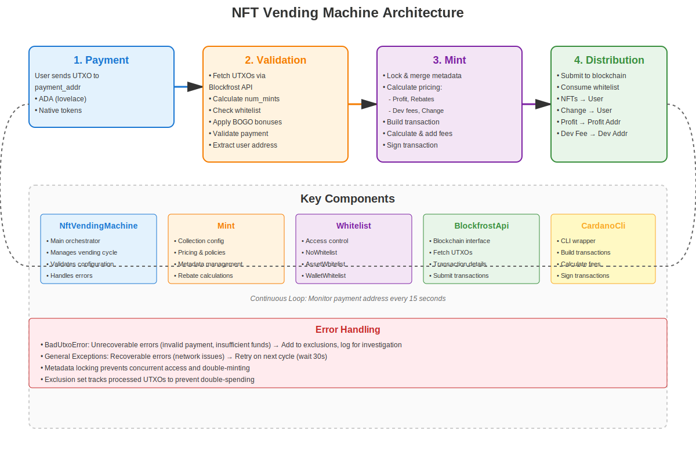

# NFT Vending Machine Architecture

## Overview

The Cardano NFT Vending Machine automates the process of minting and distributing NFTs when users send payment to a designated payment address. This document explains the complete flow from payment to NFT distribution.

## Architecture Diagram



## Flow Description

### 1. Payment Phase

**User Action:**
- User sends payment (UTXO) to the `payment_addr` on the Cardano blockchain
- Payment can be in ADA (lovelace) or native tokens configured in the mint prices

**System Processing:**
- The vending machine continuously monitors the `payment_addr` for new UTXOs
- Uses Blockfrost API to query UTXOs at the payment address
- Excludes already processed UTXOs to prevent double-spending

### 2. Validation Phase

**UTXO Retrieval:**
- Fetch transaction details using `blockfrost_api.get_tx_utxos()`
- Extract input addresses from the transaction (excluding reference inputs)
- Identify the user's payment address from transaction inputs

**Payment Validation:**
- Calculate number of NFTs requested based on payment amount:
  - For ADA: `num_mints_requested = floor(payment_amount / mint_price)`
  - For native tokens: checks each token type against configured prices
- Validate that payment contains only accepted currencies (rejects non-lovelace if not configured)
- Ensure minimum UTXO requirements are met

**Whitelist Validation:**
- Retrieve whitelist resources from transaction (assets, wallet addresses, or signatures)
- Check whitelist availability using `whitelist.available()`
- Determine maximum mints allowed based on:
  - Payment amount
  - Available NFTs in metadata directory
  - Whitelist availability
  - Single vend maximum limit

**Bonus Calculation (BOGO):**
- If BOGO is enabled, calculate eligible bonuses
- Apply bonus NFTs to the total mint count
- Final mint count: `num_mints = min(single_vend_max, available_mints, num_mints_requested, wl_availability) + bonuses`

### 3. Mint Phase

**Metadata Preparation:**
- Lock and merge NFT metadata files:
  - Select available NFTs from metadata directory (randomly if `vend_randomly` is enabled)
  - Move selected metadata files to locked subdirectory (prevents double-minting)
  - Merge metadata into a single CIP-25 compliant JSON file
  - Generate transaction ID for tracking

**Pricing Breakdown:**
- Calculate pricing breakdown for all parties:
  - **Profit Address**: Receives payment minus rebates and fees
  - **User Address**: Receives NFTs, rebates, and change
  - **Dev Address**: Receives developer fee (if configured)
- Calculate rebates based on:
  - Number of unique policies
  - Total number of NFTs
  - Total character length of NFT names
- Account for transaction fees

**Transaction Building:**
- Build raw mint transaction:
  - Add UTXO input (user's payment)
  - Add transaction outputs:
    - NFTs to user address
    - Change to user address
    - Profit to profit address
    - Dev fee to dev address (if applicable)
  - Include minting script and policy IDs
- Calculate minimum transaction fee using `cardano-cli`
- Rebuild transaction with actual fee amount

**Transaction Signing:**
- Sign transaction with:
  - Payment signing key (for spending payment UTXO)
  - Mint signing keys (for each policy being minted)

### 4. Distribution Phase

**Transaction Submission:**
- Submit signed transaction to Cardano blockchain via Blockfrost API
- Transaction includes:
  - Minting of new NFTs
  - Transfer of NFTs to user address
  - Transfer of change back to user
  - Transfer of profit to profit address
  - Transfer of dev fee to dev address (if applicable)

**Whitelist Consumption:**
- After successful transaction submission:
  - Consume whitelist resources using `whitelist.consume()`
  - For asset whitelists: move asset files to consumed directory
  - For wallet whitelists: remove wallet from available whitelist
  - Track consumption to prevent reuse

**Error Handling:**
- **BadUtxoError**: Unrecoverable errors (invalid payment, insufficient funds, etc.)
  - UTXO is added to exclusions and logged for manual investigation
- **General Exceptions**: Recoverable errors (network issues, etc.)
  - UTXO is NOT added to exclusions (will retry on next cycle)
  - System waits 30 seconds before continuing

## Key Components

### NftVendingMachine
- Main orchestrator class
- Manages the complete vending cycle
- Validates configuration before operation

### Mint
- Represents NFT collection configuration
- Manages pricing, policies, scripts, and metadata
- Handles rebate calculations

### Whitelist
- Enforces access control
- Supports multiple implementations:
  - `NoWhitelist`: No restrictions
  - `SingleUseWhitelist`: One-time use per asset
  - `UnlimitedWhitelist`: Unlimited use per asset
  - `WalletWhitelist`: Per-wallet limits

### BlockfrostApi
- Interface to Cardano blockchain via Blockfrost
- Retrieves UTXOs, transaction details, protocol parameters
- Submits transactions to blockchain

### CardanoCli
- Wrapper around `cardano-cli` command-line tool
- Builds transactions, calculates fees, signs transactions
- Validates addresses and policies

## Continuous Operation

The vending machine runs in a continuous loop:

```python
while program_is_running:
    nft_vending_machine.vend(output_dir, locked_subdir, metadata_subdir, exclusions)
    time.sleep(WAIT_TIMEOUT)  # Default: 15 seconds
```

- Each cycle processes all new UTXOs at the payment address
- Maintains exclusion set to prevent reprocessing
- Handles errors gracefully without stopping the machine

## Security Considerations

- **Payment Validation**: Only accepts configured payment methods
- **Whitelist Enforcement**: Prevents unauthorized minting
- **Double-Spend Prevention**: Exclusion set tracks processed UTXOs
- **Metadata Locking**: Files are moved to prevent concurrent access
- **Transaction Signing**: Requires proper signing keys for all operations
- **Error Recovery**: Distinguishes between recoverable and unrecoverable errors

## Configuration Requirements

Before operation, the vending machine must be validated:

- Payment address must differ from profit address
- Mint configuration must be valid
- Signing keys must exist and match addresses
- Policy scripts must match policy IDs
- Price must cover minimum UTXO and rebates

